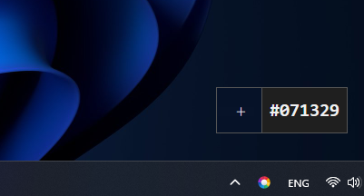
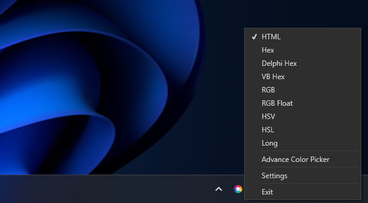
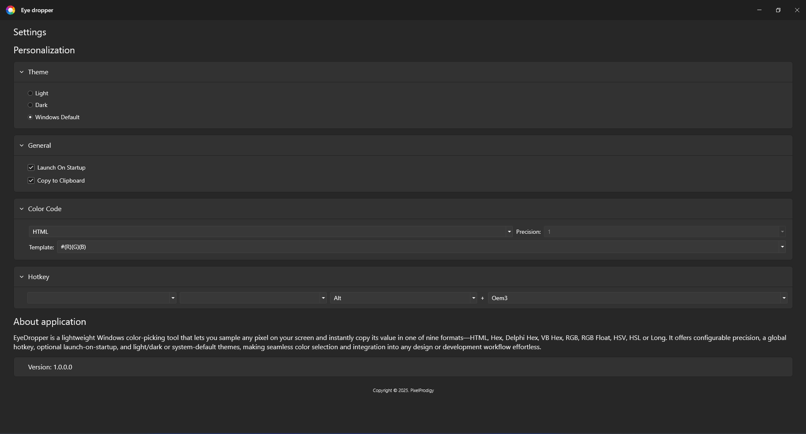
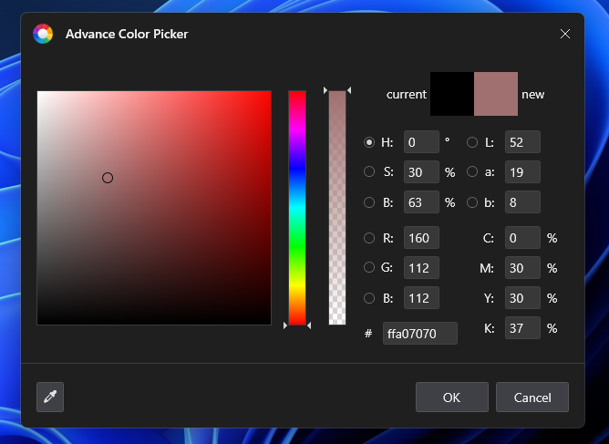

# EyeDropper

A simple and lightweight color picker utility for Windows. After installation, EyeDropper runs in your taskbar. Use it to pick colors from anywhere on your screen and instantly copy them to your clipboard in one of several formats.

---

## 🎨 Screenshots

### Color Picker Popup

Left-click the taskbar icon to activate the picker and hover over any pixel to see its color.



### Context Menu

Right-click the icon to quickly switch formats, open settings, or exit.



### Settings Dialog

Configure themes, startup behavior, clipboard options, formats, precision, and hotkeys.



### Advanced Color Picker

Fine-tune Hue, Saturation, Brightness, RGB, Lab, CMYK, and Alpha in a single dialog.



---

## Features

* **Easy Access**: Runs in the system tray; left-click to pick a color, right-click for options.
* **Multiple Color Formats**: HTML, Hex, Delphi Hex, VB Hex, RGB, RGB Float, HSV, HSL, Long.
* **Advanced Color Picker**: Built-in dialog to adjust H, S, B, R, G, B, L, a, b, C, M, Y, K, and Alpha.
* **Clipboard Integration**: Automatically copies the selected color code.
* **Dark & Light Themes**: Match Windows theme or choose explicitly.
* **Custom Hotkey**: Default `Alt + ~`, configurable in settings.
* **Launch on Startup**: Enable or disable automatic startup.

---

## Installation

1. Download the latest installer from the [Releases](https://github.com/gachris/EyeDropper/releases).
2. Run `Setup.EyeDropper.exe` and follow the on-screen prompts.
3. Launch EyeDropper; the icon will appear in your taskbar notification area.

---

## Usage

1. **Pick a Color**

   * **Left-click** the EyeDropper icon to activate the magnifier.
   * Move the mouse over any pixel; a preview shows the current color.
   * **Click** to copy the color code to your clipboard in your selected format.

2. **Change Format**

   * **Right-click** the icon and choose one of the formats:

     * HTML
     * Hex
     * Delphi Hex
     * VB Hex
     * RGB
     * RGB Float
     * HSV
     * HSL
     * Long

3. **Settings**

   * **Right-click > Settings** to open the configuration dialog.
   * **Personalization**: Light, Dark, or Windows Default theme.
   * **General**: Launch on startup, copy on pick.
   * **Color Code**: Select default format, precision, and output template (e.g., `#{R}{G}{B}`).
   * **Hotkey**: Assign or change the global activation key.

4. **Advanced Picker**

   * **Right-click > Advanced Color Picker** or click the picker icon in the popup.
   * Adjust sliders and numeric fields for precise control.
   * Enter a hex value directly or tweak Lab/CMYK channels.

---

## Development

This repo includes a GitHub Actions workflow that builds the application in **Release** mode, packages a Windows installer (`.exe`), and publishes it to GitHub Releases.

**To build locally:**

```bash
git clone https://github.com/gachris/EyeDropper.git
cd EyeDropper
```

1. Open the solution in Visual Studio.
2. Build **EyeDropper** and **EyeDropper.Setup** in *Release* configuration.
3. Find the installer under `.setup/` in the root directory.

---

## Contributing

Contributions, issues, and feature requests are welcome! Please check the [issues page](https://github.com/gachris/EyeDropper/issues) before submitting a pull request.

---

## License

This project is licensed under the MIT License. See the [LICENSE](LICENSE) file for details.
